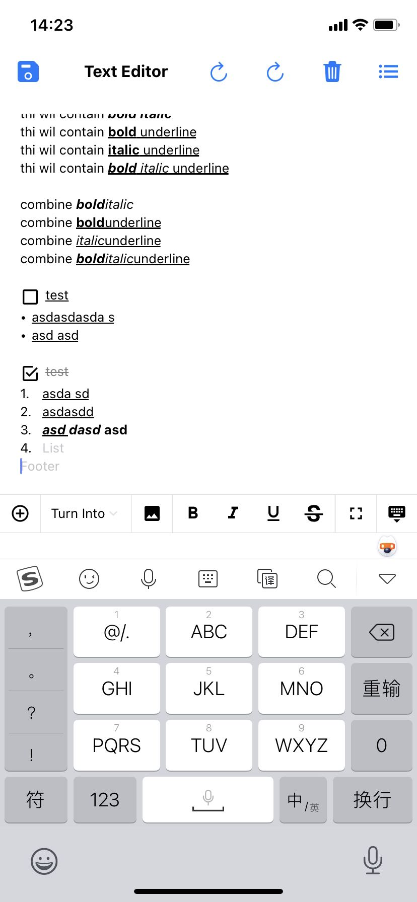

# react-native-editor

[](https://www.npmjs.com/package/@apprush/react-native-editor) 
[](https://github.com/jerloo/react-native-editor/blob/master/LICENSE) 
 
 <!-- [](https://circleci.com/gh/facebook/react) -->
<!-- [](https://github.com/prettier/prettier)
[](https://travis-ci.org/jeremaihloo/react-native-editor)
 -->
<!-- [](https://paypal.me/jeremaihloo) -->

A rich text editor for react native. Supports Draft.js and Markdown.

Copied source code from https://github.com/vobi-io/markdown-editor



### Installation

```bash
yarn add @apprush/react-native-editor
```

### Usage


```tsx
<SafeAreaView style={{ flex: 1 }}>
    <Container>
        <KeyboardAwareView keyboardShouldPersistTaps animated>
            <View style={styles.editor}>
            <TextEditor
                ref={(e) => {
                editor = e
                }}
                data={contentState}
                onChange={this.onChange}
                extraData={this.state.extraData}
            />
            </View>
            <TextToolbar />
        </KeyboardAwareView>
    </Container>
</SafeAreaView>
```

### To Do

- [x] Convert from Draft.js contentState
- [x] Convert to Draft.js contentState
- [ ] Convert from Markdown
- [x] Convert to Markdown
- [x] Bold
- [x] Italic
- [x] Underline
- [x] Strikethrough
- [x] Move line up & down
- [x] Bullets (Unordered List)
- [x] Numbered List (Ordered List)
- [x] Blockquote
- [x] Heading 1
- [x] Heading 2
- [x] Heading 3
- [ ] Font colors
- [ ] Tables
- [ ] Insert images
- [ ] Intends